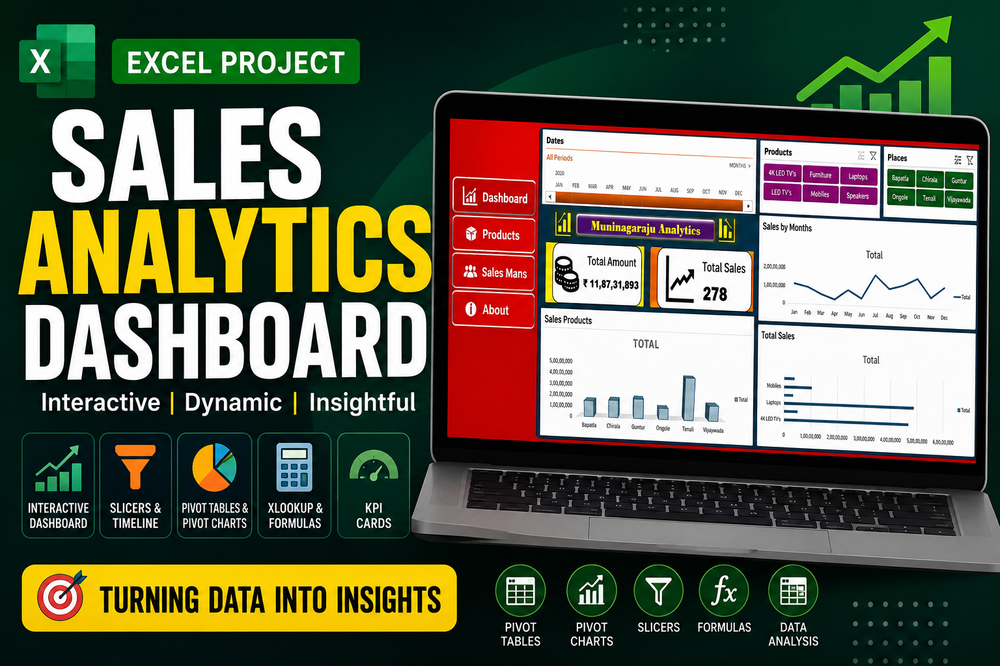

# 📉 Excel Sales Analytics Dashboard

An interactive **Sales Analytics Dashboard** built using **Microsoft Excel** to analyze sales performance across products, locations, salespersons, and time periods. This dashboard enables users to explore business insights through dynamic filters, KPI cards, Pivot Tables, and Pivot Charts.

---

##  Project Overview

This project demonstrates how Microsoft Excel can be used as a powerful Business Intelligence (BI) tool to create interactive dashboards for sales analysis. It provides meaningful insights into sales trends, product performance, regional performance, and overall business metrics using advanced Excel features.

---

## 🚀 Dashboard Preview

### Main Dashboard

.png)

### Main Dataset

.png)

### Pivot Tables & Charts

.png)

> **Note:** Update the image paths if your image names or folders are different.

---

## 🎯 Features

- 📅 Interactive Timeline Filter (Year & Month)
- 📦 Product-wise Sales Analysis
- 📍 Place-wise Sales Analysis
- 👨‍💼 Salesperson-wise Analysis
- 💰 KPI Cards for Total Amount & Total Sales
- 📈 Monthly Sales Trend Analysis
- 📊 Interactive Pivot Charts
- 🎛️ Dynamic Slicers
- ⚡ Automatic Dashboard Updates
- 📑 Business Performance Reporting

---

## 🛠️ Tools & Technologies

- Microsoft Excel
- Pivot Tables
- Pivot Charts
- Slicers
- Timeline Filter
- XLOOKUP
- Conditional Formatting
- Excel Formulas
- Data Validation

---

## 📂 Dataset Information

The dataset contains sales transaction records with the following fields:

| Column | Description |
|---------|-------------|
| Date | Sales Date |
| Sales Person | Employee responsible for the sale |
| Product | Product Category |
| Place | Sales Location |
| Price | Unit Price |
| Units | Quantity Sold |
| Amount | Total Sales Amount |

---

## 📈 Dashboard Insights

The dashboard helps answer business questions such as:

- Which product generated the highest sales?
- Which location has the highest revenue?
- Which months performed best?
- How many sales were completed?
- Which salesperson contributed the most revenue?
- What are the monthly sales trends?

---

## 📊 KPIs Included

- ✅ Total Sales Amount
- ✅ Total Sales Count
- ✅ Monthly Sales Trend
- ✅ Product-wise Sales
- ✅ Place-wise Sales

---

## 📁 Project Structure

```
Excel-Sales-Analytics-Dashboard/
│
├── Excel_Sales_Analytics_Dashboard.xlsx
├── README.md
├── images/
│   ├── dashboard.png
│   ├── main-data.png
│   └── pivot-table.png
```

---

## 💼 Skills Demonstrated

- Data Cleaning
- Data Validation
- Dashboard Design
- Business Intelligence
- Data Visualization
- Excel Reporting
- Pivot Tables
- Pivot Charts
- XLOOKUP
- Conditional Formatting
- KPI Reporting
- Interactive Dashboard Development

---

## 🎯 Business Use Cases

This dashboard can be used by:

- Sales Managers
- Business Analysts
- MIS Executives
- Data Analysts
- Operations Teams
- Business Owners

---

## 👨‍💻 Author

**Gudiboyina Muninagaraju**

📧 Email: gudiboyinamuninagaraju@gmail.com

🔗 LinkedIn: https://www.linkedin.com/in/YOUR-LINKEDIN

💻 GitHub: https://github.com/YOUR-GITHUB

🌐 Portfolio: https://YOUR-PORTFOLIO

---

## ⭐ If you found this project useful, please consider giving it a Star!
